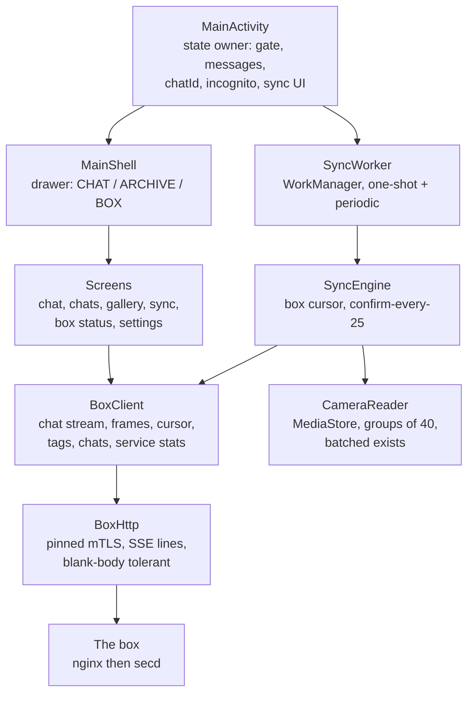

# App architecture , one channel to the box, three columns inside

The app is a thin, honest client: it renders what the box says, keeps almost no durable state of
its own (the box is the cursor authority, the chat archive, and the gallery), and funnels every
byte through one pinned mTLS channel. When this document and the code disagree, the code wins.

Reading it:

- **MainActivity owns the state that matters**: the gate (biometric auto-fires on return from
  background), the visible conversation and its `chatId` (adopting a box chat means continuation,
  not a fork), the incognito flag (visible state, never silent), and the sync UI fed by BOTH work
  names with a merge gate so only the RUNNING one paints.
- **The drawer is organised by what the person is thinking about**: CHAT first with expandable
  recents (5, "view more" to 10, "see all" beyond), YOUR ARCHIVE (gallery, memories, sync), THE BOX
  (status, models, notifications, connectors, codes), app tail below the divider.
- **The sync stack is its own column** and touches the network only through BoxClient. The phone
  keeps NO persistent cursor: every run fetches the box's `(ts, id)` per kind, confirms in memory,
  reports every 25 items and at run end. Reinstalls resume instead of re-walking. Existence checks
  hash in groups of 40 , one round trip per group, uncertainty always uploads.
- **BoxHttp is the single choke point**: certificate pinning, JSON with a read-timeout parameter
  (chat waits 6 minutes , deep-think is legitimately slow), an SSE line reader whose early stop
  disconnects (which cancels generation on the box), and blank-body tolerance so 204s do not read
  as failures.
- **Chat streaming is real**: the context event arrives first (what was injected and why , the
  transparency record and the prompt material are the same struct on the box, so they cannot
  disagree), then tokens as the model generates, then done carrying the `chatId`.

## What the app deliberately does NOT do

- No local cursor, no local chat archive of record, no local tag state , the box owns all three;
  the app renders and corrects.
- No trust in names: the gallery shows derived display names, but identity is the content hash.
- No invisible privacy: incognito is a visible toggle stating exactly what is and is not saved.
